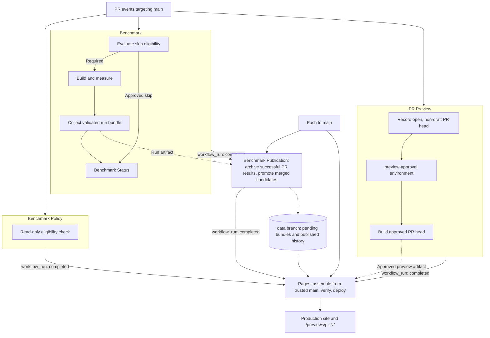

# Development Guide

See the [project overview](../README.md) for an introduction.

## Development

Use Node.js 24 or later.

```sh
npm ci
npm run dev
```

The dashboard loads published history from
`https://raw.githubusercontent.com/hyperlight-dev/hyperlight-bench/data/index.json`.
Local development uses that history too. Until the data branch is published,
the dashboard shows `Data unavailable`.

Open `http://localhost:5173/?demo=1` for synthetic data.
Demo view links retain the `demo=1` parameter.

Set `VITE_HISTORY_URL` in `.env.local` to select another history index:

```dotenv
VITE_HISTORY_URL=/data/index.json
```

This example serves files from `public/data/`. An absolute HTTPS URL can point
to another host that allows cross-origin requests. Relative URLs resolve against
the page URL. Restart the dev server after changing the setting. Production
builds capture its value during `npm run build`.

The index and bundles follow [the history format](results.md#history-index).
An empty index shows `No published runs yet`. Fetch or validation failures show
`Data unavailable` and log details in the browser console. Local benchmark
summaries are not loaded by this interface.

## Benchmark Commands

### Local End To End

Requires Linux x86_64, Node.js 24+, Rust, just, and read/write access to
`/dev/kvm` or `/dev/mshv`. Install wasm-tools 1.259.0 or newer,
hyperlight-wasm-aot 0.15.0, cargo-hyperlight 0.1.14,
componentize-qjs-cli 0.3.0 with `--no-default-features`, and oha 1.9.0.
Use `cargo install <crate>@<version> --locked` for each tool.
Place the pinned tools on `PATH` before building.

```sh
npm ci
just setup-rust-wasm-toolchain
just build-benchmark-artifacts
npm run benchmark:local -- --platform kvm
npm run dev:local
```

Open the URL printed by Vite. The dashboard labels these results Local.
The collector runs all 18 runtimes and three lifecycle strategies sequentially.
Each configuration receives 60 seconds of load, requiring at least 54 minutes
per platform. Use `--platform mshv3` on an MSHV host.
Build and measure on the target host. Local collection does not contact Azure
metadata or GitHub and cannot publish to CI history.

For a short verification run across all 54 configurations:

```sh
npm run benchmark:local -- --platform kvm --smoke
```

Add `--runtime hyperlight-wasm-qjs` to run one runtime's three strategies.
Smoke mode sends one measured request per configuration with one connection
and a 120-second client timeout. It verifies execution and result loading,
not performance stability. The bundle records the request count and load settings.
JIT-heavy configurations can still take several minutes across the full matrix.

Timed runs accept `--duration` and `--client-timeout` in seconds.
The default client timeout is unlimited. Requests still in flight are cancelled
when the load duration ends. `--client-timeout` enables a per-request limit.
`--concurrency` sets the connection count. For slower local hosts, use:

```sh
npm run benchmark:local -- --platform kvm --duration 60 --concurrency 1 --client-timeout 120
```

Timeouts and missing latency samples fail validation. All local load overrides
are recorded and keep the results separate from CI history.

Raw output is retained under `results/local/<run-id>/`. A complete successful
run writes an immutable bundle under `public/local-data/runs/` and atomically
updates `public/local-data/index.json`. The site selects the latest successful
run. Failed runs retain their diagnostics and leave the index unchanged.
Both directories are ignored by Git. Local runs record CPU, memory, OS, and
tool metadata. SKU and pool are `local`, and Azure region is null.
Git revisions describe HEAD with uncommitted changes noted in the message.
Unversioned directories use zero SHAs and an explicit unversioned message.

```sh
npm test
npm run build
```

These commands run local publication and Pages tests and compile the dashboard.
They require no GitHub credentials. Hosted approvals, runner permissions, and
deployment still require verification in GitHub Actions.

### Individual Commands

Run `just` to list commands and their descriptions.
Build commands require the tool versions pinned in `.github/actions/setup/action.yml`.
QuickJS requires `componentize-qjs-cli` 0.3.0 on the command's `PATH`.
The isolated local installation is not automatically selected yet.
Use `just setup-rust-wasm-toolchain` to install the Rust component toolchain.

| Command | Scope |
| --- | --- |
| `just build-benchmark-artifacts` | All guest inputs and both server binaries |
| `just build-benchmark-inputs` | WIT, jco/QuickJS/Rust Wasm, native/Pulley AOT, and the native dummy guest |
| `just build-server-binaries` | Both release server binaries and build metadata |
| `just build-native-server [extra-features]` | Native release server, optionally with `time_phases` |
| `just build-pulley-server [extra-features]` | Pulley release server, optionally with `time_phases` |
| `just build-handler-wit` | Binary WIT interface |
| `just build-jco-wasm` | StarlingMonkey Wasm component |
| `just build-qjs-wasm` | QuickJS Wasm component |
| `just build-rust-wasm` | Rust Wasm component |
| `just compile-native-aot <wasm-input> <aot-output>` | Native AOT compilation |
| `just compile-pulley-aot <wasm-input> <aot-output>` | Pulley AOT compilation |
| `just build-hyperlight-dummy-guest` | Native Hyperlight baseline guest |

Server builds invalidate only the `hyperlight-wasm` release package before
each flavor. Its build script embeds a guest from a shared path. Invalidation
ensures that path contains the requested native or Pulley runtime.
Other Cargo caches, cache keys, and permissions are retained.

Guest selection and AOT target are separate commands. For example:

```sh
just build-qjs-wasm
just compile-native-aot js/componentize-qjs/handler.wasm js/componentize-qjs/handler.aot
just compile-pulley-aot js/componentize-qjs/handler.wasm js/componentize-qjs/handler.pulley.aot
```

`just run-server <runtime> <strategy>` starts a built server on port 3000.
Hyperlight Pulley runtime IDs select `artifacts/bin/pulley/http-bench`.
Other runtime IDs select `artifacts/bin/native/http-bench`.
Strategy arguments remain `new` (Renew), `reload` (Restore), and `reuse` (Reuse).
`just run-http-load [url] [duration] [output]` sends load to an existing server.
Its defaults are `http://127.0.0.1:3000`, `10s`, and `perf.json`.

`just run-local-benchmark <runtime> <strategy> [timeout-ms] [timeout-check-interval-ms] [duration]`
builds both standard server binaries, starts the selected server, runs oha, and stops it.
Guest inputs must already exist. Defaults remain `1000`, `10`, and `60s`.
This local workflow produces root-level summaries and retains the imported load settings.
CI uses `scripts/benchmark.ts` for validated bundles and runner metadata.

`just clean-build-artifacts` removes generated build outputs.
`just clean-local-benchmark-results` removes root-level performance and memory summaries.

## Validation

```sh
npm run build
npm run validate -- --fixtures
npm run validate -- --complete run.json
npm run validate -- --policy policy.json run.json
node --test scripts/publication.test.ts
```

The fixture command validates the run bundles and their dashboard projection.
JSON inputs may contain a single run bundle or a dashboard selection archive.

Publication tests use temporary stores and simulated GitHub and Git responses.
They cover immutable writes, promotion retries, conflicts, stale provenance,
label changes, and archive retention after promotion failure. They make no
network requests or remote writes. Live workflow validation remains separate.

See [the result contract](results.md) for fields and validation rules.

## Local Publication Commands

```sh
npm run results:store -- --directory ./data-store run.json
npm run results:publish -- --directory ./data-store publication.json
```

`results:store` validates a complete run against the shared publication policy
and stores its immutable bundle. It leaves the history index unchanged.
`results:publish` reads that stored bundle and the supplied merge provenance,
then writes a publication record and updates the history index.
Both accept `--policy policy.json` for a trusted policy captured for the measured revision.

Promotion requires `run.pullRequest` in the stored bundle. PR benchmark runs
record this provenance. See [publication records](results.md#publication-records)
for the input format and trust requirements.

These commands only write local files. They make no GitHub requests, commits,
pushes, or deployments. The separate CI publisher performs GitHub verification
and data-branch writes. Pages deployment manages preview cleanup.

## Workflow Overview

Solid arrows show triggers and job order. Dotted arrows show artifacts and data.
Each PR workflow subscribes to its own set of `pull_request` events.



The policy workflow also receives PR closure events. Its check job is skipped
on closure, and workflow completion triggers Pages cleanup.
Publication accepts successful PR runs and checks merge
provenance before adding results to published history.

## PR Eligibility And Publication

`Benchmark Policy` uses `pull_request` with read-only permissions and runs
trusted `main` scripts on hosted runners. Its job check reports eligibility.
The job summary records the PR head, base, and benchmark decision. Benchmark
jobs also evaluate eligibility before starting the self-hosted stages.

To skip benchmarks, a maintainer with write access must apply `benchmarks: skip`.
The allowlist covers `docs/`, `src/`,
`public/`, the README, license, and HTML entry point. Renames check
both paths. Cargo, JavaScript guests, shared contracts, dependencies, scripts,
and workflow changes require benchmarks.
After correcting a failed policy decision, rerun the Benchmark workflow if needed.

The publisher reevaluates eligibility when archiving and promoting results.
An approved skip publishes no measurements. Removing the label requires a
complete benchmark run for the current candidate.

`Benchmark Publication` runs trusted `main` scripts on hosted runners. Successful
PR attempts are checked against GitHub workflow and commit metadata. All jobs
must have a successful latest result through the selected attempt. Use
**Re-run failed jobs** to retain successful configurations, or rerun an individual
job and its dependents. Each retry replaces its configuration's result artifact.
Collection combines the artifacts from that workflow run.
A failed retry blocks publication even if an earlier
attempt succeeded. Source revisions and benchmark definitions must match.
Use **Re-run all jobs** when required artifacts have expired.
The executed Benchmark workflow must match the trusted workflow. A workflow
change can require archival recovery after maintainer review and merge.

Validated bundles and trusted policies are retained on `data`, with a pending
pointer for each PR. A push to `main` resolves merged PRs through GitHub's
commit association API and promotes their archived results. Merge promotion
requires the current PR head and a merged
tree matching the measured candidate. It records the selected attempt and
updates history. It never launches a benchmark run.
PR website previews and Pages deployment use separate workflows.

Publication jobs share a concurrency group, fetch the latest data branch, and
use ordinary pushes. Push conflicts fail. Rerun a failed archival job to retain
its artifact. Rerun the failed publication workflow to retry promotion.
Missing or expired artifacts require a new approved benchmark run.
Stale candidates and changed merged trees fail publication.
If a push commit list is unavailable or truncated, rerun the publication workflow
that archived each merged PR's results. Archival also promotes results for merged PRs.

### Repository Requirements

Before enabling PR execution:

* Require `Benchmark Policy` and `Benchmark Status` and an up-to-date branch before merge.
* Benchmark jobs run PR code on self-hosted runners with no environment approval gate.
* Use isolated, disposable self-hosted runners with restricted credentials and network access.
* Protect `main` and the trusted workflow scripts. Restrict `data` writes to the publisher.
* Allow the trusted publication workflow to create and update `data`.

PR caches remain scoped to GitHub's PR merge ref. The original producer and
platform cache keys, setup action, and designated writers are retained.
Trusted policy and publication jobs use hosted runners, install dependencies
with lifecycle scripts disabled, and do not restore PR caches or execute artifacts.
These repository settings cannot be enforced by the workflow files themselves.

## Pages And PR Previews

Configure GitHub Pages to deploy through **GitHub Actions**. Create the
`preview-approval` environment with required maintainer reviewers. Keep it free
of secrets. Enable prevention of self-review and disable administrator bypass
where available. The `github-pages` environment is used for final deployment.

`PR Preview` uses `pull_request` with read-only permissions. It records the open
PR head and pauses at `preview-approval`.
The approval job names the full revision and links to its commit. A maintainer
uses **Review deployments**, then **Approve and deploy**. Each new head starts
a new approval. No label or comment is needed for preview approval.

The approved head is built on a separate disposable hosted runner with read-only
permissions. PR code never runs in the approval or Pages deployment jobs.
The build artifact is named for the PR, head, and attempt and retained for 90 days.
Draft PRs have no preview. Rerun all jobs to rebuild an expired preview.

`Pages` builds production from current `main` and discovers successful preview
builds for current open PR heads. It matches GitHub run metadata to the PR number,
head, and source repository. It verifies the trusted preview workflow and
the revision-specific approval job. A changed preview workflow requires fresh
approved builds. Closed, merged, draft, and outdated previews are omitted.

One artifact contains production at `/` and previews at `/previews/pr-<number>/`.
These paths are relative to the site's base URL, including a GitHub project path
when one is configured. Builds use relative asset and data URLs.

Production receives only runs in the published index. Each preview receives
published history plus its current pending run, when available.
The pending run must match the PR head and base. Approved benchmark skips use
published history. Preview headers identify the PR revision and pending-data
status. A preview with no available runs shows an empty state. Different
benchmark definitions form separate selectable histories. Production defaults
to the group with the newest run. Previews default to the pending result's
group. Charts and downloads use only the selected compatible group.

Assembly starts from a fresh directory. It rejects symlinks, hidden entries,
special files, and builds over 100 MiB or 10,000 files. Builds must reserve
`data/` and `previews/` for the assembler. Avoid placing those directories in
`public/` for deployed builds.

Pages jobs share a concurrency group. They discover preview builds during
assembly, then recheck refs, PR revisions, eligibility, and selected builds
before deployment. Changed inputs fail the
job. Rerun Pages if a newer event has not already queued a replacement. An event
during deployment is reflected by the next serialized deployment.

Main pushes and completion of preview, publication, or policy workflows refresh
Pages. PR lifecycle changes trigger the policy workflow. Its completion wakes
the trusted Pages workflow through `workflow_run`. Pages rereads GitHub state
and executes only `main` code. Rerun Pages to recover a failed deployment.
Closing a PR removes its path on the next successful deployment. Expired build
artifacts are omitted when Pages next assembles the site.

Preview JavaScript shares the production origin. Environment approval is required
because preview paths are not a security boundary. These workflows have been
validated locally, not executed on GitHub. Environment rules and Pages settings
must be configured before enabling them.

## CI Setup And Caching

The setup action matches the source repository's action byte for byte.
It sets `CARGO_HOME=/opt/cargo`, configures `PATH`, repairs Cargo home ownership,
and reuses installed tools through the original version checks.

The producer writes `kvm-amd-producer-v2`. Platform preparation writes
`kvm-amd-build-v2` or `mshv3-amd-build-v2` and skips compilation on an exact cache hit.
Benchmark jobs restore those platform caches with `BENCH_ONLY=true` and cache writes disabled.
Each benchmark job builds its selected server flavor before starting the server.
The collector invokes `oha` from the setup action's `PATH`.
Guest components and embedded runtime binaries are shared through artifacts.

The producer retains the guest npm cache key. Configure, measurement, and
collection jobs restore the TypeScript npm cache. PR jobs do not save npm caches.

## CI Failure Policy

PR benchmark runs target `main` and record the
tested merge candidate. `Benchmark Status` requires successful eligibility and
all benchmark stages, including collection. An approved skip requires successful
eligibility and omits benchmark stages. Other failed, cancelled, skipped, and
missing stages fail this gate.

Build commands propagate child-process failures and require nonempty artifacts.
Component generation removes its previous output before running.
Measurement removes previous summaries before launching the server.
Supervised server panics terminate the process with a failure exit code.
Benchmark failures print their reason in the job log and emit an error annotation.
Raw summaries and server logs remain available as job artifacts.

Collection requires all 108 successful configurations and the expected machine SKUs.
Invalid metrics, missing results, and request errors reject the run.
The duration-limited workload permits up to 50 `aborted due to deadline` cancellations.
These represent in-flight requests at the measurement deadline and remain in the raw summary.
`fail-fast: false` lets other matrix jobs finish collecting diagnostics. Failed jobs retain their failed status.

## Platform Support

The benchmark targets Linux KVM and MSHV across 18 runtimes and three lifecycle strategies.
Windows/WHP support is deferred pending a reusable prepared AOT mapping API and runner validation.

Hyperlight Wasm prepares a private file-backed AOT mapping once per worker.
Each sandbox context uses `load_module_by_mapping`. Renew reuses the worker's mapping.
The mapping remains alive until its worker and sandbox contexts are released.
The upstream API can fall back to copying if guest mapping fails.
The AOT loading method is recorded in the benchmark settings.

## Handler Configuration

The HTTP endpoint invokes a fixed guest request and ignores HTTP request bodies.
Benchmark version 2 excludes body collection and unused queue timestamps.
Phase timing counters are compiled only with `time_phases`. Shutdown writes
memory results and any enabled phase report before exiting.
Renew phase reports include context creation in `load` and destruction in `unload`.
Memory method version 2 takes a final RSS sample at shutdown and combines it
with the 500 ms samples. This covers runs shorter than the sampling interval.

The server announces readiness after every worker completes initial setup.
Restore creates its initial context, and Reuse also loads it. Renew prepares
worker state and creates contexts per request. Startup fails if a worker fails
or the pool exceeds its 120-second startup deadline. The benchmark records
`workerReadiness: all-workers`. The collector still sends one readiness request
and performs no warmup.

Component paths and Hyperlight memory settings live in `crates/server/src/handlers/config.rs`.
`Runtime::start_pool` maps each CLI runtime to a backend configuration.
Hyperlight Wasm selects scratch memory through `PerStrategy` during context creation.
Each runtime can select its own memory settings.

`Handler::prepare_worker` reads or maps artifacts once per worker.
The worker pool owns the Renew, Restore, and Reuse loops.
Wasmtime compiles Wasm or deserializes native/Pulley AOT during context creation.
Its engine and pooling allocator are also created there.

To add a component variant, define its artifact paths, select its memory settings,
and add its runtime mapping and shared catalog entry.
A new execution backend implements `Handler`.