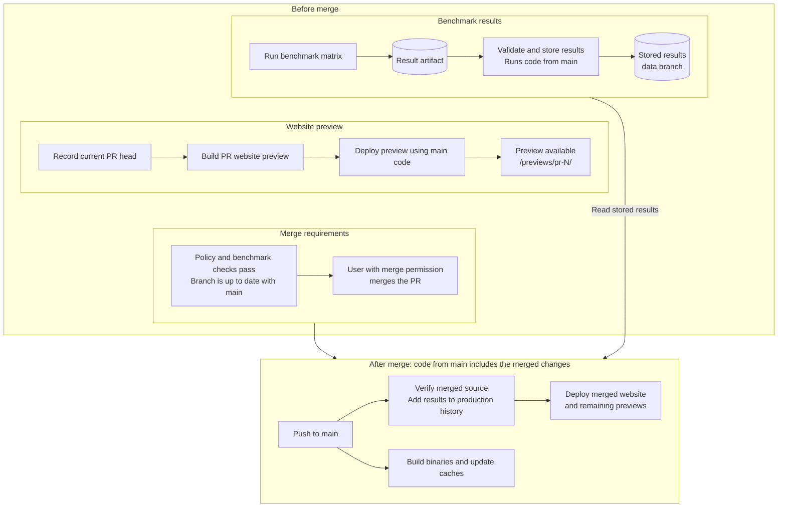

# Development Guide

See the [project overview](../README.md) and [result format](results.md).

## Development

Requires Node.js 24 or later.

```sh
npm ci
npm run dev
```

Development loads published history. Use `?demo=1` for synthetic data or set
`VITE_HISTORY_URL` in `.env.local` to select another index.

## Local Benchmarks

Requires Linux x86_64, Rust, just, and access to `/dev/kvm` or `/dev/mshv`.
Run `just setup-tools` to install the versions pinned in
[tool-versions.sh](../tool-versions.sh). Build recipes use the tools on `PATH`.

```sh
npm ci
just setup-tools
just setup-rust-wasm-toolchain
just build-benchmark-artifacts
npm run benchmark:local -- --platform kvm
npm run dev:local
```

Set a Git revision to test an unpublished tool build. Set the matching Git URL
as well when using a fork.

```sh
COMPONENTIZE_QJS_GIT_REV=<commit> just setup-tools
HYPERLIGHT_WASM_AOT_GIT_REV=<commit> just setup-tools
```

Use `--platform mshv3` on MSHV. A full run takes at least 54 minutes per platform.
Add `--smoke` for one request per configuration or `--runtime <id>` to limit runtimes.
Raw output is in `results/local/`. Successful runs update `public/local-data/`.

## Validation

```sh
npm test
npm run build
```

Tests simulate GitHub. Validate permissions and deployment changes in Actions.

## Workflow Overview

Arrows show execution and data paths. Cylinders store results.



## Website Previews

One GitHub Pages deployment contains separate HTML, JavaScript, and CSS builds:

* `/` serves website code from `main` with published benchmark history.
* `/previews/pr-N/` serves website code from PR N with published history and matching validated pending results when available.

Previews show UI changes before merge, even when pending benchmark results are unavailable.
After a PR is merged or closed, the next successful Pages deployment removes its preview.
The preview URL then returns 404.

## CI Rules

* `benchmarks: skip` replaces publishable measurements with one-request smoke coverage on KVM and MSHV. Smoke results are not published. Dependabot applies the label automatically.
* Required checks reevaluate when code, the base branch, or the `benchmarks: skip` label changes. Other labels and title or body edits refresh the required contexts after active checks finish.
* Each of the 36 measurement jobs runs all three strategies sequentially with a fresh server process for each. Retrying a job repeats its three strategies.
* Preview builds run independently of benchmarks. Draft PRs have no preview.
* Production uses published history. Previews include matching pending results when available.
* Benchmark trigger, workload, and preview workflow YAML must match `main` before publishers accept their artifacts.
* Merge requires `Benchmark Policy`, `Benchmark Status`, an up-to-date branch, and squash merging. Required PR review count is zero. Preview and publication success do not block merge.

Publication calls Pages after a main push or a data change. Pages also runs for
successful preview builds and preview eligibility changes. Run Pages manually
after a direct push to `data`.

Publication and Pages use serial queues with up to 100 pending jobs or runs each.
Benchmark checks ignore unrelated labels and title or body edits.

## Security

* Outside contributors require **Approve and run**. Collaborators run automatically. Allowing preview execution also permits serving its JavaScript to visitors.
* PR jobs use read-only repository permissions. The separate `workflow_run` publishers execute `main` code with their own tokens.
* Benchmark Publication uses `contents: write` and `statuses: write`. It commits to `data` as `github-actions[bot]` and restricts write paths in code.
* Pages handles PR metadata with `pull_request_target` and executes only `main` code.
* Pages uses `pages: write` and `id-token: write`. Configure Pages for GitHub Actions and restrict the `github-pages` environment to `main`.
* Publishers validate PR artifacts as untrusted input. They do not execute artifact scripts or restore PR caches. Workflow matching cannot prove measurements are genuine.
* PRs can change workflows and check scripts. Inspect those changes before allowing execution or merging. Self-hosted runners must be disposable and isolated from credentials and sensitive networks.
* Preview JavaScript shares production's origin and browser storage. Separate-origin hosting is required for browser isolation.